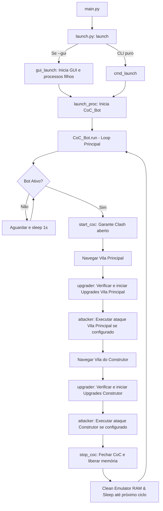

# Clash of Clans Bot - Master Context for AI Agents

Este arquivo serve como ponto de entrada e referência lógica para qualquer agente de IA que atue neste repositório. Ele explica a arquitetura do projeto, a pilha de tecnologia, os fluxos principais e as diretrizes de desenvolvimento para garantir consistência e performance.

---

## 📂 Estrutura do Projeto

```
M_CoC_Bot/
├── app/                    # Aplicativo Web (Flask) para monitoramento e controle
│   ├── app.py              # Backend Flask (endpoints de status, controle de execução)
│   ├── templates/          # Interfaces HTML
│   ├── static/             # Arquivos CSS/JS do painel web
│   └── wsgi.py             # Configuração para deploy no PythonAnywhere
├── assets/                 # Templates de imagens e fontes para Visão Computacional (OCR / MatchTemplate)
├── bin/                    # Binários essenciais (ADB para Windows)
│   ├── adb.exe
│   └── AdbWinApi.dll
├── media/                  # Capturas de tela e materiais de demonstração
├── scripts/                # Scripts de controle operacional e build
│   ├── build.sh            # Build do executável desktop
│   ├── start.template.sh   # Template de inicialização
│   └── stop.sh             # Script para encerrar processos do bot
├── src/                    # Código-fonte principal do bot (Python)
│   ├── main.py             # Ponto de entrada que chama o launch.py
│   ├── launch.py           # Orquestrador de processos (GUI multi-instância vs CLI)
│   ├── coc_bot.py          # Loop principal do ciclo de automação e gerenciamento de estado
│   ├── attacker.py         # Lógica de ataques, detecção de cartas de tropas e deploy tático
│   ├── upgrader.py         # Lógica de upgrades (construções, heróis, laboratório e construtor)
│   ├── utils.py            # Helpers do sistema (ADB, pyminitouch, OCR, notificações, navegação)
│   ├── configs.py          # Configurações dinâmicas ativas (copiadas do configs.template.py)
│   ├── configs.template.py # Template de configurações padrões
│   └── requirements.txt    # Dependências do bot
├── LICENSE                 # Licença MIT do projeto
├── README.md               # Instruções de setup e documentação para humanos
└── Agent.md                # Este arquivo - guia contextual de IA
```

---

## 🛠️ Stack Tecnológica & Funcionamento

O bot funciona emulando ações de toque em uma instância de emulador **BlueStacks** configurada especificamente (Samsung Galaxy S22 Ultra, 1920x1080, 60fps). Todo o controle e captura de tela são feitos via **ADB (Android Debug Bridge)**.

### Tecnologias-Chave:
1. **Controle de Entrada Otimizado**: Usa o `pyminitouch` para simular múltiplos toques em alta velocidade no Android, permitindo deploys ultra-rápidos impossíveis de fazer com comandos de toque padrão do ADB.
2. **Visão Computacional & OCR**:
   - `cv2` (OpenCV) para template matching na localização de ícones (como o barco, botões de upgrade, etc.).
   - Processamento de imagem avançado (`Canny`, `Sobel`, filtros de cor baseados em espaço de cor RGB/HSV) para segmentar a tela de deploy de tropas.
   - OCR local ou via API do `Groq` para decodificar textos numéricos (ex: tempo restante de upgrade, contagem de construtores).
3. **Comunicação Web & Notificações**:
   - APIs REST do **Telegram** para notificar o progresso do bot ao usuário.
   - Aplicação web Flask (`app/app.py`) que gerencia estados em tempo real e permite pausar/retomar a execução do bot, com suporte opcional a sincronização no PythonAnywhere.
   - Interface desktop (`gui.py`) que roda uma GUI local integrada caso configurado.

### 💻 Compatibilidade & Codificação no Windows (UTF-8)
O ambiente padrão de execução do usuário é **Windows (sem venv)** executando Python globalmente. Por conta disso, duas regras críticas de compatibilidade foram estabelecidas no ponto de entrada do bot:
1. **Monkey Patch de `locale`**: No Windows, as saídas do ADB vêm codificadas em UTF-8. O Python padrão no Windows tenta decodificar subprocessos usando `cp1252`, gerando `UnicodeDecodeError`. No início de `main.py`, forçamos `locale.getpreferredencoding` e `locale.getencoding` a retornarem `utf-8`.
2. **Reconfiguração de stdout/stderr**: Para evitar `UnicodeEncodeError` ao printar símbolos como a seta (`→`) no console CP1252/cp850 do Windows CMD/PowerShell, reconfiguramos o console para UTF-8 usando `sys.stdout.reconfigure(encoding='utf-8', errors='replace')`.
3. **Dependência do `uiautomator2`**: A pasta interna `src/uiautomator2` foi removida no upstream e substituída por uma biblioteca instalada globalmente via pip (`pip install uiautomator2`). Não recrie esta pasta localmente.


---

## 🔄 Fluxos de Execução Principais



### 1. Detecção de Tropas (`attacker.py` -> `detect_troop_positions`)
O bot realiza a análise do frame inferior da tela de batalha para ler as cartas de tropas disponíveis:
- Aplica um filtro de Sobel no canal de escala de cinza equalizado para destacar as bordas verticais das cartas.
- Utiliza `scipy.signal.find_peaks` para encontrar a coordenada X dos limites dos cards na tela.
- Classifica o card entre `troop`, `spell`, `clan` ou `hero` avaliando assinaturas visuais (como presença de badges de clã ou percentual de cor azul nos cantos).
- Lê o multiplicador (quantidade) renderizando templates dos números e cruzando com OCR de alta performance.

### 2. Fluxo de Deploy (`attacker.py` -> `deploy_troops`)
- Para evitar cliques sequenciais lentos, o bot usa `pyminitouch` para segurar o ponto de toque primário e realizar cliques dinâmicos nos cards de tropas.
- Detecta o esgotamento da tropa monitorando a saturação do card (cards cinzas/desaturados indicam que a tropa foi completamente lançada).
- Suporta a configuração `AUTO_COMPLETE_BATTLE`: reinicia o Clash of Clans logo após mandar todas as tropas a campo para forçar o término imediato da batalha no servidor e poupar tempo de simulação.

---

## ⚠️ Regras Operacionais para Agentes de IA

1. **Sempre respeite as regras de layout de tela**: O bot assume coordenadas de tela relativas de `0.0` a `1.0`. Modificações de posição devem ser muito testadas para não quebrar em resoluções `1920x1080`.
2. **Integridade de Dependências**: As bibliotecas como `uiautomator2` e `pyminitouch` exigem serviços rodando no emulador. Não remova as rotinas de reconexão ou prevenção de falhas em `start_coc()` e `connect_adb()`.
3. **Não commite arquivos de configuração com credenciais reais**: Nunca inclua `TELEGRAM_BOT_TOKEN`, `GROQ_API_KEY` ou senhas no `configs.template.py`. Modificações de código devem focar na lógica, deixando configurações no escopo do usuário.
4. **Performance**: O loop do bot lida com buffers OpenCV pesados. Use `gc.collect()` em ciclos de longa duração e evite carregar imagens do disco repetidamente (use cache do `Asset_Manager`).
5. **Comportamento de Git**: Nunca dê `git push` no repositório do Clash of Clans (`M_CoC_Bot`) sem autorização explícita do usuário.
6. **Linguagem**: Toda e qualquer resposta de interação com o usuário deve ser **estritamente em português**, conforme as regras globais do usuário.
